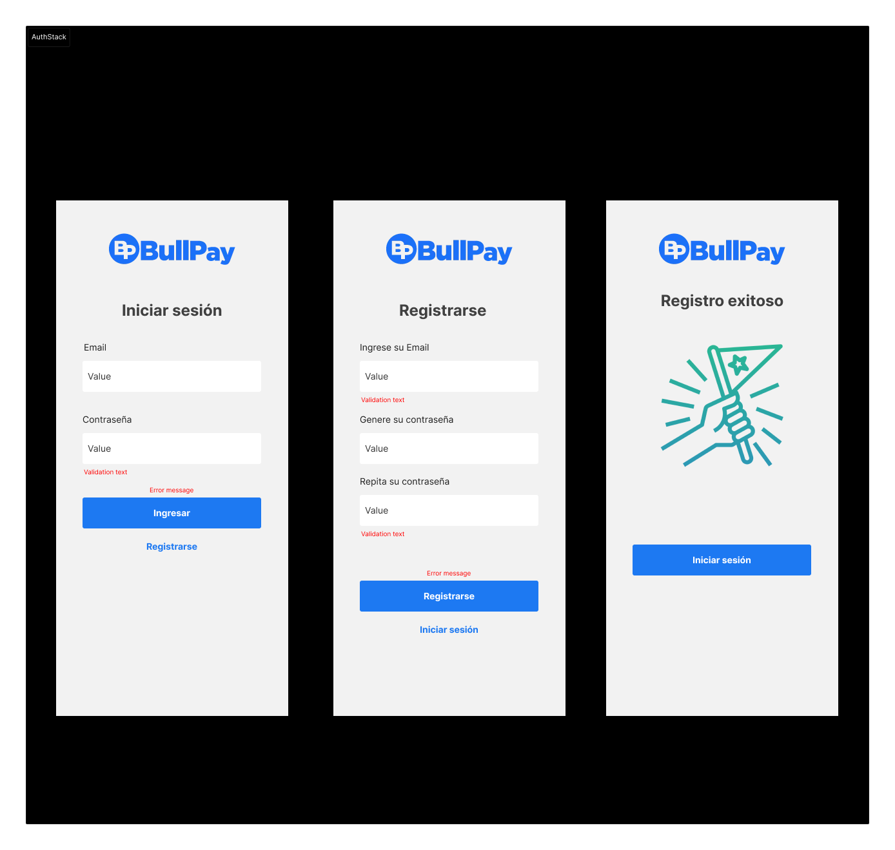
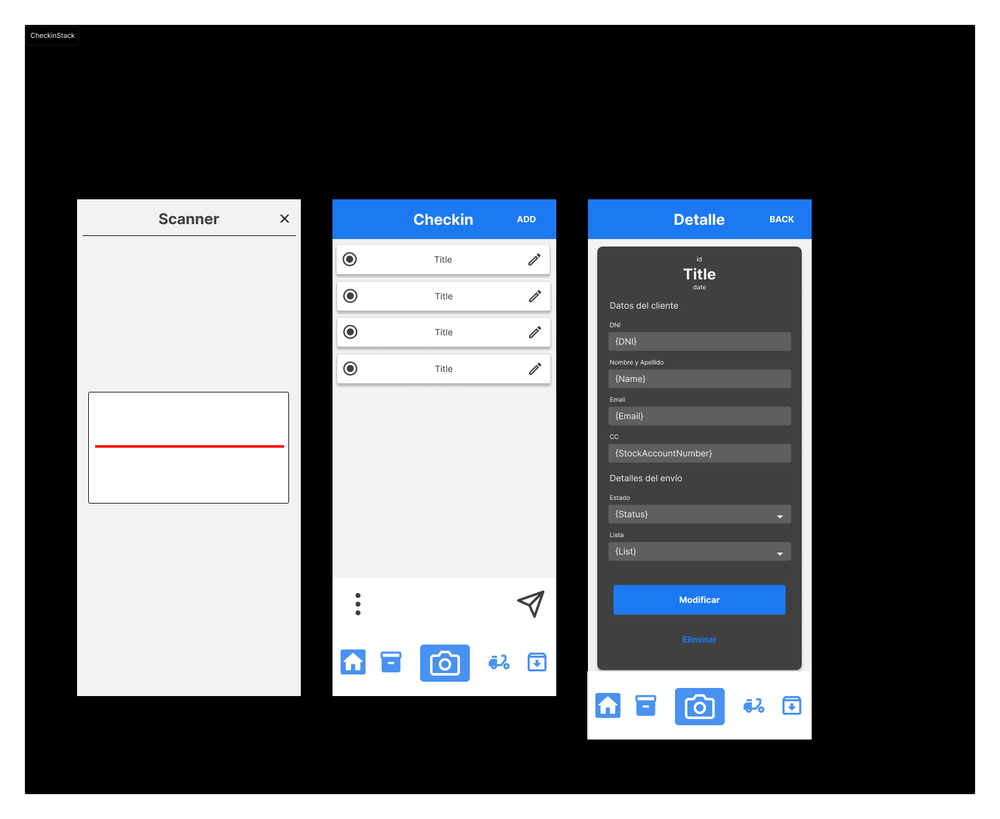
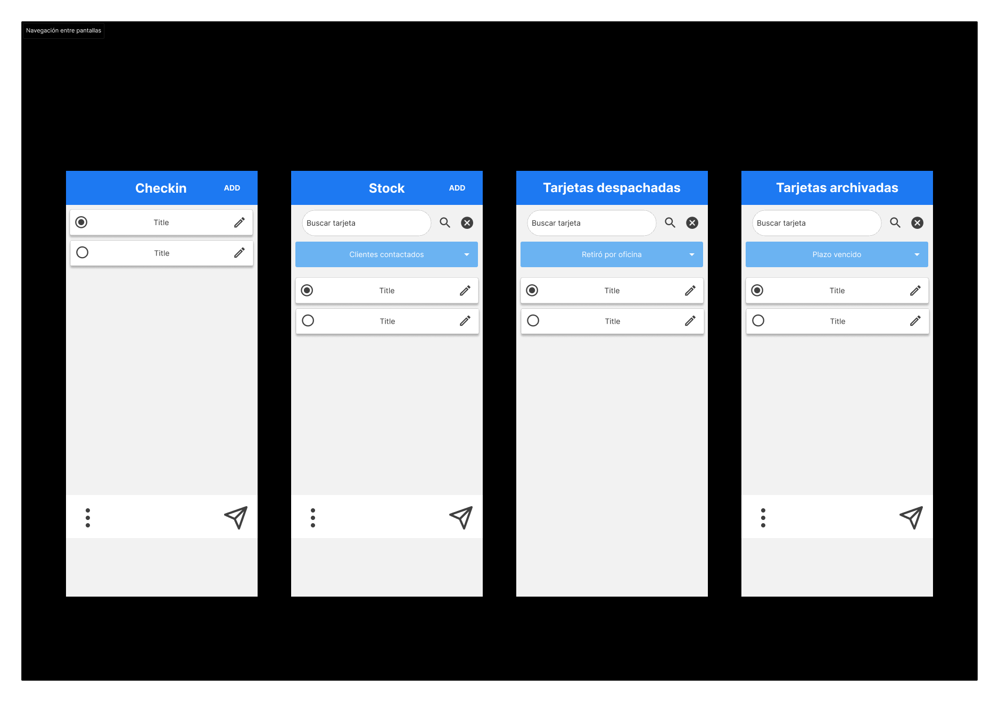

# ScanMyStock
Una aplicación de control de inventario con Scanner de código de barras desarrollado con Expo y React Native.

Este es un MVP de la aplicación que cuenta con las funciones mínimas e indispensables para poder ser usada en mi trabajo, donde emitimos tarjetas de crédito. Cuando alguna tarjeta que no puede ser entregadas, vuelve a la oficina; teniendo que realizar un control de seguimiento y contacto a los clientes para reenviarselas. 

La aplicación busca solucionar el control de seguimiento, escaneando los códigos de seguimiento.

## Metodología de trabajo
### Análisis funcional
1. Se definieron las necesidades del usuario
2. Se listaron las funciones de la app
3. Se definió el MVP para el primer release

Acceda al tablero de Figma donde se realiza un análisis detallado de las necesidades del usuario y el flujo de trabajo: https://www.figma.com/board/CSo7Bq5yd86kOjeekzHkkN/BP---App-Card-Scanner?node-id=0-1&t=aTVFyVRfnRFD1Qo3-1

### Diseño y prototipado
1. Arquitectura de la información: se definió los roles de usuarios y las instancias
2. Interfaz: se definieron los patrones de navegación, componentes, pantallas, iconos, botones y comunicación
3. Wireframes: se definieron las pantallas en base a las funcionalidaes
4. Diseño: se diseñó la UX/UI con estilos, imagenes, componentes, pantallas, stacksd e navegación

Acceda a los diseños en Figma: https://www.figma.com/design/H5VPVWwXtTYKPYoG2KYJhg/BP-Scanner-Design?node-id=0-1&t=UpdLglpvQo8pksmA-1

### Desarrollo y testeo
Se desarrolló la app y se testeó en local con Expo de React Native 

## Funcionalidades principales
### Cuenta de operador
- Registro de operador
- Login de operador

### Envíos
#### Escanear tarjetas
- Checkin: abre la camara en un modal y guarda las tarjetas en una lista de Checkin

#### Listas de seguimiento
- Visualizar las diferentes listas: En stock, Despachadas y Archivadas

#### Modificar los estados de seguimiento (Generar insignias)
- Estado de Contacto con cliente: Primer contacto, Segundo contacto, Tercer contacto
- Estado de Respuesta del cliente: Retiro por oficina, Envío a domicilio, Envío a punto Pickit
- Estado de Acción a realizar: PARA DESPACHAR, PARA ARCHIVAR
- Estado de Acción realizada: DESPACHADA, ARCHIVADA

#### Administrar envíos
- Buscador: se puede buscar una tarjeta específica en una lista de seguimiento
- Navegación: se pueden visualizar y enviar items entre listas
- Modificar item: se pueden cargar los datos de un item de manera individual

## Tecnologías utilizadas
- **Firebase Authentication:** Implementa el sistema de autenticación de Firebase para gestionar la seguridad de la aplicación.
- **React Native Async Storage:** Permite guardar el estado de autenticación entre sesiones para que Firebase Auth se inicialice con un almacenamiento persistente.
- **React Native Navigation Stack:** Gestiona la navegación entre pantallas.
- **React Native Navigation Bottom Tabs:** Gestiona la navegación entre pestañas.
- **Expo-Camera:** Permite acceder a la camara y escanear códigos de barra o QR.
- **Expo SQLite:** Permite el acceso a una base de datos que persiste en los reinicios de la app.
- **Redux:** Centraliza y gestiona el estado de la aplicación.
- **RTK Query y Firebase:** Realiza operaciones de lectura/escritura en la base de datos.
- **yup:** Permite crear esquemas de validación para la autenticación de los usuarios.

## Instalación
1. Clona el repositorio: `git clone https://github.com/gpoplavsky/ScanMyStock.git`
2. Instala las dependencias de package.json: `npm install`
- `npm install expo`
- `npm install expo-camera`
- `npm install expo-sqlite`
- `npm install firebase`
- `npm install yup`
- `npm install @reduxjs/toolkit`
- `npm install @react-native-async-storage/async-storage`
- `npm install @react-native-firebase/auth`
- etc.
4. Configura las claves de API para servicios externos (Firebase, etc.).
5. Configura las credenciales de Firebase en tu proyecto.
6. Ejecuta la aplicación: `npm start`

## Contacto
Guillermo Poplavsky
gpoplavsky@bullmarketbrokers.com
